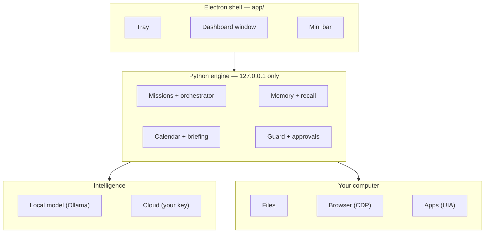

<div align="center">


# Wisp

**A local AI that lives on your desktop, sees what you see, and gets your work done.**

*It knows your files, your calendar, your browser — and it acts, right on your screen.*

[](docs/WISP.md)
[](dashboard/serve.py)
[](app/)
[](docs/WISP.md)
[](LICENSE)

<br/>

<!-- demo video: drop docs/media/hero.gif (or an mp4 link) here -->


*Demo videos landing here soon.*

</div>

---

## What is Wisp

Copilot lives in a chat box. **Wisp lives on your computer.**

Wisp is a desktop AI assistant with a real body on your machine: a tray app,
a full dashboard, and an always-on-top **mini bar** — a dynamic island for
Windows. Ask it by typing or by voice. It reads your real life (files,
calendar, mail), drives your real browser, and every risky action stops for
your confirmation first.

The raw personal data stays on your machine: a local model handles anything
touching it, and the cloud is only consulted for planning and vision — with
your own API key, under your control.

<div align="center">

<!-- demo video: minibar voice + browser control clip -->


</div>

## The pillars

| | |
|---|---|
| **Mini bar** | Always-on-top glass bar. Global hotkey, mic with Whisper, live agent activity, popup briefs — the dynamic island for Windows. |
| **Browser control** | Drives your signed-in Edge/Chrome over CDP: reads pages, selects, fills carts, clicks. Irreversible steps confirm-gate in the bar. |
| **Life dashboard** | Calendar, mail, briefing, and a writing surface in one place — with add-your-own widget rows. |
| **Developer console** | The full agent orchestration workbench — spawn, monitor, intervene, recover — one tab over. |

## Quickstart

```bash
# engine only (browser dashboard)
python dashboard/serve.py        # -> http://127.0.0.1:8817/dashboard/

# the real thing (desktop app)
cd app && npm install && npm start
```

`Ctrl+Shift+Space` summons the mini bar from anywhere.

## Architecture



The engine is dependency-free Python stdlib, binds to localhost only, and
runs fine without the shell. The shell makes it a citizen of your desktop.
Full spec: [`docs/WISP.md`](docs/WISP.md).

## Trust model

- **Local-first**: raw personal data is processed by the local model.
- **Confirm gates**: purchases, sends, deletes, and credential use always
  pause for you — in the mini bar, one keypress away.
- **Shown hands**: every mission, every action, in an auditable activity
  tray. Wisp never works behind your back.
- **Localhost boundary**: the engine never listens beyond 127.0.0.1.

## Status

Wisp is mid-metamorphosis from [Rune](docs/WISP.md), an agent-orchestration
workbench that ran real multi-agent coding missions daily. The orchestration
core is battle-tested; the desktop body is new. Windows 11 first, macOS
after.

<div align="center">

MIT · built in the open

</div>
