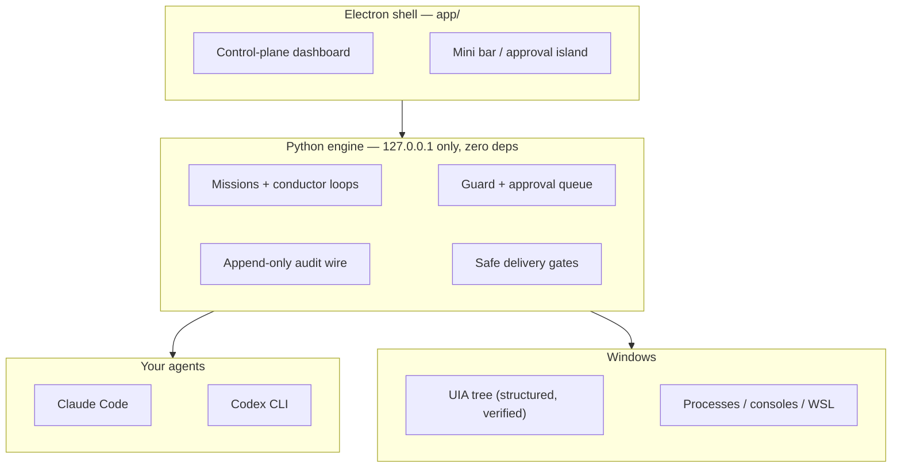

<div align="center">


# Wisp

**A local control plane for agentic development on Windows and WSL.**

*Run many long-lived coding agents on your own machine — spawn, watch, approve, stop, resume, audit, roll back.*

[](docs/WISP.md)
[](dashboard/serve.py)
[](app/)
[](docs/WISP.md)
[](LICENSE)

<br/>

<!-- demo video: drop docs/media/hero.gif (or an mp4 link) here -->


*Demo videos landing here soon.*

</div>

---

## The problem

Everyone running Claude Code or Codex in a loop is improvising operational
hygiene with tmux and hope. Agents die silently mid-mission. Nothing stands
between an agent and `git push --force`. There's no durable record of what an
agent actually did, no resume after a crash, and every agent shares one
credential soup.

Wisp is the missing control plane — local, on the platform where the tooling
is weakest.

## What it does

| | |
|---|---|
| **Spawn + watch** | Launch real Claude Code / Codex sessions (console or headless), track liveness by PID, focus or kill any of them from one surface. |
| **Missions** | Long-running worker/critic revision loops with per-round logs, honest failure classification, bounded retries, and resume via `--resume`. |
| **Approval queue** | Destructive, outward, spending, and credential actions pause as `waiting_permission`. Allow/retry/deny is bound to a request id — a stale click can never approve a newer request. Approvals reachable from the always-on-top mini bar. |
| **Audit wire** | Every observable action lands on an append-only event log. If it's not on the wire, it didn't happen. |
| **Safe delivery** | Scoped review → test → commit gates between an agent's work and your branch. |
| **Panic stop** | One call stops every live loop and mission, process-tree deep. |
| **UIA actions** | When agents must touch Windows apps: structured UI Automation — read the accessibility tree, invoke controls, then *verify* the click landed and the field holds the value. No screenshots on the hot path. |

<div align="center">

<!-- demo video: approval-island clip -->


</div>

## Why UIA and not screenshots

Screenshot-driven computer use is slow, expensive per action, and brittle.
Windows exposes a real accessibility tree — controls, values, invocations —
as structured data. Acting on that tree is faster, cheaper, deterministic,
works when the window isn't focused, and is **verifiable**: Wisp asserts the
action actually took effect and reports honestly when it didn't. Reliability
is the unsolved problem in agents; *works and admits failure* beats *reads
your whole life*.

## Quickstart

```bash
# engine only (browser dashboard)
python dashboard/serve.py        # -> http://127.0.0.1:8817/dashboard/

# desktop app (tray + approval island)
cd app && npm install && npm start
```

`Ctrl+Shift+Space` summons the mini bar from anywhere.

## Architecture



The engine is dependency-free Python stdlib and binds to localhost only —
that is the security boundary. Full spec: [`docs/WISP.md`](docs/WISP.md).

## Honest reliability, as policy

- Classified failures, bounded retries, interruptible backoff — transient
  errors retry, everything else surfaces.
- A server restart mid-loop shows as `stalled`, never silently rewritten.
- Automation can never self-approve; permission states are operator-only.
- Late worker output cannot overwrite a stopped state.

## Status

The orchestration core ran real multi-agent coding missions daily in its
previous life as Rune. The control-plane surface and UIA runtime are being
sharpened in the open. Windows + WSL first.

<div align="center">

MIT · built in the open

</div>
