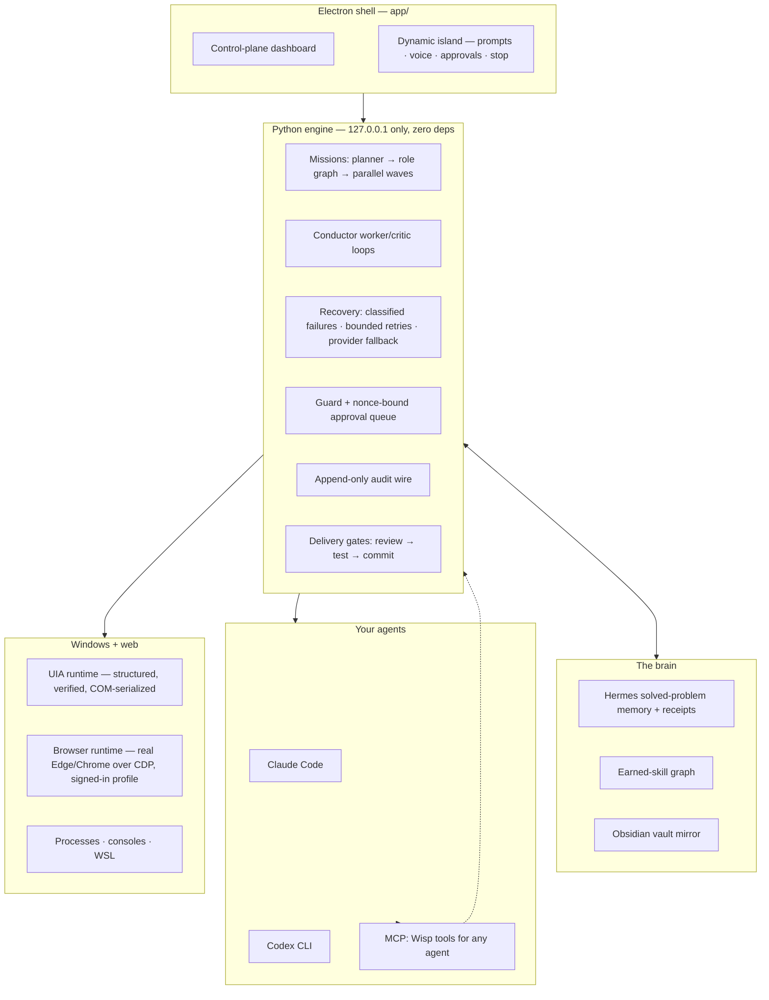

<div align="center">


# Wisp

**A local control plane for agentic development on Windows and WSL.**

*Run many long-lived coding agents on your own machine — spawn, watch, approve, stop, resume, audit, roll back — with a brain that remembers every hard-won fix.*

[](docs/WISP.md)
[](dashboard/serve.py)
[](app/)
[](docs/WISP.md)
[](mcp/server.py)
[](LICENSE)

<br/>

<!-- demo video: drop docs/media/hero.gif (or an mp4 link) here -->


*Demo videos landing here soon.*

</div>

---

## The problem

Everyone running Claude Code or Codex in a loop is improvising operational
hygiene with tmux and hope. Agents die silently mid-mission. Nothing stands
between an agent and `git push --force`. There's no durable record of what an
agent actually did, no resume after a crash, agents re-solve problems that
were already solved last week, and every agent shares one credential soup.

Wisp is the missing control plane — local, on the platform where the tooling
is weakest.

## The dynamic island

An always-on-top glass bar (`Ctrl+Shift+Space`) — mission control that
follows you to whatever you're doing:

- **Prompt anything** — typed or spoken; voice is transcribed locally by
  Whisper, and Wisp talks back.
- **Approval queue, in place** — when an agent hits a destructive, outward,
  spending, or credential boundary it pauses, and the island shows
  *Allow & resume / Retry after fixing / Deny & skip*, bound to a request id
  so a stale click can never approve a newer request.
- **Live agent tracker** — how many missions are running and what they are;
  completion and daily-brief toasts as native Windows notifications.
- **Stop and undo** — one press (or saying "stop") panic-stops every live
  loop and mission, process-tree deep; undo queues a revert directive.
- **Reaches into the browser** — island prompts can drive the Wisp browser
  (below): "check my open GitHub PRs", "reorder last night's Uber Eats" —
  same engine, same approval gates.

<div align="center">

<!-- demo video: island approval + voice clip -->


</div>

## The control plane

| | |
|---|---|
| **Spawn + watch** | Launch real Claude Code / Codex sessions (console or headless), track liveness by PID, focus or kill any of them from one surface. |
| **Missions** | A command bar turns a prompt into a planned mission: planner → typed roles with a dependency graph → workers. Independent roles run as **parallel waves**; dependent work stays ordered by its edges. |
| **Conductor loops** | Long-running worker/critic revision rounds with per-round logs and accept/revise/reject gates — multi-pass quality without babysitting. |
| **Recovery** | Failures are classified before anything acts: transient errors retry with bounded backoff, task failures get at most two reversible fixer cycles verified by the original role, capacity limits can hand the role to a local Codex CLI once, and a crash mid-loop surfaces as `stalled` — never silently rewritten. |
| **Approval queue** | Guarded actions pause as `waiting_permission`; automation can never self-approve; permission decisions are operator-only and nonce-bound. |
| **Audit wire** | Every observable action lands on an append-only event log. If it's not on the wire, it didn't happen. |
| **Safe delivery** | Scoped review → test → commit gates between an agent's work and your branch, with path-scoped fingerprints so unrelated churn can't wedge a review. |
| **Accounts** | Multiple Claude accounts with true per-account usage windows; missions pick the least-used account automatically. |

## The brain

Agents that forget are expensive. Wisp ships a local memory that compounds:

- **Hermes** — a solved-problem store. Query before hard work, record after a
  verified fix. Cards mirror into an Obsidian vault as markdown.
- **Deterministic recall** — the model never decides whether to search;
  recall runs before CEO planning, workers, and chat, and every attempt
  writes a bounded, secret-safe **receipt** (query fingerprint, ranked cards,
  what was actually inserted into the prompt) — retrieval you can audit, not
  vibes.
- **Retention with taste** — verified root causes and recipes are kept; raw
  logs, one-off status, and vague fixes are quarantined. Every store has
  explicit count/byte limits; when space runs out, new candidates are
  rejected explicitly instead of eating your SSD.
- **Earned skills** — a skill graph where capabilities are earned after
  repeated real use and decay when they stop serving the current goal —
  the registry reflects what actually works, not what was scaffolded.
- **Auto-learn** — a global hook can feed every coding session's verified
  lessons back into the brain, deduplicated against what's already known.

## The UIA runtime

When agents must touch Windows apps, screenshot-driven computer use is slow,
expensive, and brittle. Windows exposes a real accessibility tree —
controls, values, invocations — as structured data. Wisp's runtime acts on
that tree: faster, cheaper, deterministic, works when the window isn't
focused, and **verifiable** — every action re-reads the control afterward
and returns before/after state plus a `verified` flag. Success is never
claimed unobserved. All UIA work runs on one COM-owning worker thread, so
two agents can never fight over your desktop.

## The browser runtime

Dev tools don't all live locally — GitHub, Figma, CI dashboards, and every
consumer flow (yes, an Uber Eats order) live behind a browser session. Wisp
drives a **real Edge/Chrome over CDP** with a persistent profile: sign in
to a site once and every later mission acts inside that session. Actions
are DOM operations with the same verified-readback contract as UIA — click
reports whether the element was found, fill reports the value the field
actually holds, and absence is reported honestly instead of guessed
around. Purchases and sends still stop at the mission approval gate; the
runtime gives capability, the guard decides.

## Agent tools over MCP

Agents get all of it through **nine MCP tools** — `desktop_windows`,
`window_tree`, `ui_act`, `ui_read`, `browser_tabs`, `browser_open`,
`browser_act`, `agent_activity`, `stop_all` — served by a thin stdio
bridge to the engine, so one instance keeps owning COM, browser sessions,
approvals, and the wire:

```bash
claude mcp add wisp -- python mcp/server.py
```

## Architecture



The engine is dependency-free Python stdlib and binds to localhost only —
that is the security boundary. Full spec: [`docs/WISP.md`](docs/WISP.md).

## Honest reliability, as policy

Reliability is the unsolved problem in agents. *Works and admits failure*
beats *claims success*:

- Classified failures, bounded retries, interruptible backoff — transient
  errors retry, everything else surfaces with a stated reason.
- Out of turns is `exhausted` (cut off, resumable), not "done".
- A server restart mid-loop shows as `stalled`, never silently rewritten;
  late worker output cannot overwrite a stopped state.
- Every UIA action returns observed state, not assumed state.
- Recall writes receipts proving what was retrieved and inserted.

## Quickstart

```bash
# engine only (browser dashboard)
python dashboard/serve.py        # -> http://127.0.0.1:8817/dashboard/

# desktop app (tray + dynamic island)
cd app && npm install && npm start

# prove the UIA runtime (drives Calculator via automation ids, asserts the display)
pip install pywinauto && python test_uia_runtime.py

# prove the scheduler, the MCP bridge, and the browser runtime (no model spend)
python test_parallel_roles.py && python test_mcp_server.py
pip install websocket-client && python test_browser_runtime.py
```

## Status

The orchestration core, brain, and recovery runtime ran real multi-agent
coding missions daily in this codebase's previous life as Rune. The desktop
shell, dynamic island, UIA runtime, parallel waves, and MCP bridge are the
new control-plane surface, sharpened in the open. Windows + WSL first.

Near-term: per-agent credential scoping (DPAPI), WSL spawn parity, per-role
worktrees, installer.

<div align="center">

MIT · built in the open

</div>
